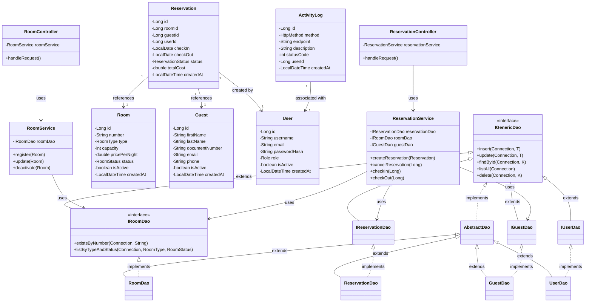

# Diagrama de Clases - Proyecto Hotel

Este diagrama representa la arquitectura del sistema de gestión hotelera, siguiendo el patrón **MVC (Modelo-Vista-Controlador)** y utilizando el patrón **DAO (Data Access Object)** para la persistencia.

## Detalles de la Arquitectura

1.  **Capa de Modelo**: Contiene las entidades POJO que representan las tablas de la base de datos (`Room`, `Guest`, `Reservation`, `User`).
2.  **Capa DAO (Persistencia)**:
    *   **IGenericDao**: Interfaz genérica con operaciones CRUD básicas.
    *   **AbstractDao**: Implementación base que reduce la duplicación de código JDBC.
    *   **Implementaciones Específicas**: Manejan la lógica SQL particular de cada entidad.
3.  **Capa de Servicio**: Contiene la lógica de negocio, validaciones y gestión de transacciones.
4.  **Capa de Controlador**: Gestiona la interacción con el usuario y delega las acciones a los servicios correspondientes.
5.  **Enums**: El sistema utiliza enums para estados y tipos (`RoomStatus`, `RoomType`, `ReservationStatus`, `Role`), garantizando la integridad de los datos.
